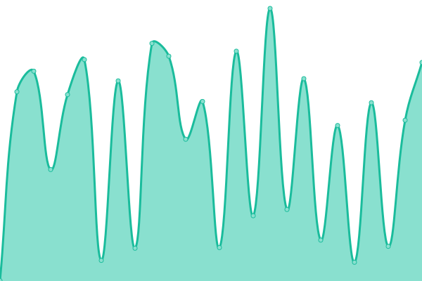
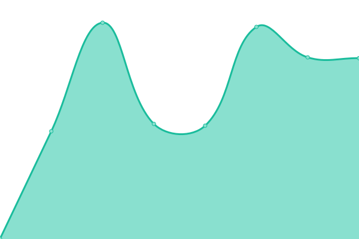
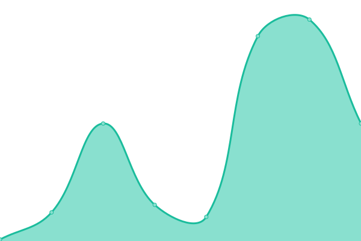

# [📈 Live Status](https://status.steffengivard.dk): <!--live status--> **🟩 All systems operational**

This repository contains the open-source uptime monitor and status page for [Steffen Givard](steffengivard.dk), powered by [Upptime](https://github.com/upptime/upptime).

With [Upptime](https://upptime.js.org), you can get your own unlimited and free uptime monitor and status page, powered entirely by a GitHub repository. We use [Issues](https://github.com/SteffenGivard/uptime/issues) as incident reports, [Actions](https://github.com/SteffenGivard/uptime/actions) as uptime monitors, and [Pages](https://status.steffengivard.dk) for the status page.

<!--start: status pages-->
<!-- This summary is generated by Upptime (https://github.com/upptime/upptime) -->
<!-- Do not edit this manually, your changes will be overwritten -->
<!-- prettier-ignore -->
| URL | Status | History | Response Time | Uptime |
| --- | ------ | ------- | ------------- | ------ |
|  [Steffen Givard](https://steffengivard.dk) | 🟩 Up | [steffen-givard.yml](https://github.com/SteffenGivard/uptime/commits/HEAD/history/steffen-givard.yml) | 

 450ms
     
 | 

<a href="https://SteffenGivard.github.io/uptime/history/steffen-givard">100.00%</a>
    

|  [Martin Roos](https://martinroos.dk) | 🟩 Up | [martin-roos.yml](https://github.com/SteffenGivard/uptime/commits/HEAD/history/martin-roos.yml) | 

 741ms
     
 | 

<a href="https://SteffenGivard.github.io/uptime/history/martin-roos">100.00%</a>
    

|  [Bjarke Kingo](https://bjarkekingo.dk) | 🟩 Up | [bjarke-kingo.yml](https://github.com/SteffenGivard/uptime/commits/HEAD/history/bjarke-kingo.yml) | 

 82ms
     
 | 

<a href="https://SteffenGivard.github.io/uptime/history/bjarke-kingo">100.00%</a>
    

|  [Sportsapp](64.190.90.48) | 🟩 Up | [sportsapp.yml](https://github.com/SteffenGivard/uptime/commits/HEAD/history/sportsapp.yml) | 

 54ms
     
 | 

<a href="https://SteffenGivard.github.io/uptime/history/sportsapp">100.00%</a>
    

|  [Culture Me](https://www.culture-me.dk) | 🟩 Up | [culture-me.yml](https://github.com/SteffenGivard/uptime/commits/HEAD/history/culture-me.yml) | 

 1503ms
     
 | 

<a href="https://SteffenGivard.github.io/uptime/history/culture-me">100.00%</a>
    

<!--end: status pages-->

[**Visit our status website →**](https://status.steffengivard.dk)

## 📄 License

- Powered by: [Upptime](https://github.com/upptime/upptime)
- Code: [MIT](./LICENSE) © [Steffen Givard](steffengivard.dk)
- Data in the `./history` directory: [Open Database License](https://opendatacommons.org/licenses/odbl/1-0/)
